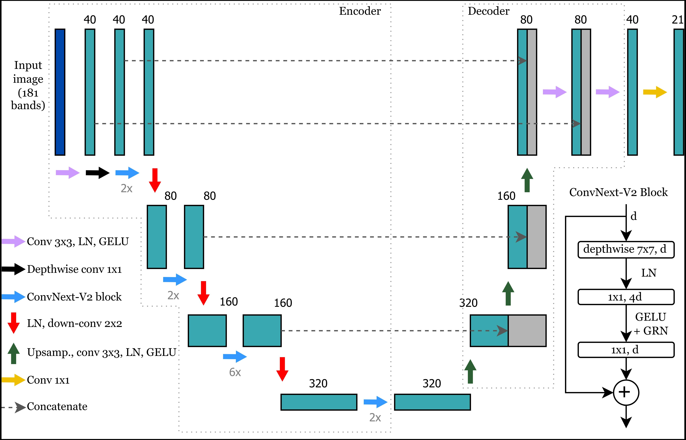
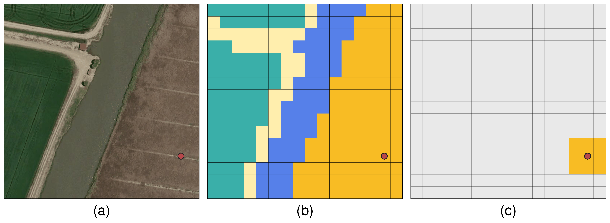
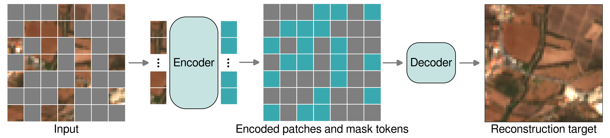

# A weakly and self-supervised learning approach for semantic segmentation of land cover in satellite images with National Forest Inventory data
We used data for the Portuguese National Forest Invetory (NFI) as sparse labels to train a ConvNext-V2 model in a weakly supervised fashion. We explored the use of a self-supervised pretrained Masked Autoencoder (MAE) to improve the weakly supervised model's semantic segmentation accuracy.

### ConvNext-V2 U-Net

We use a U-Net model based on the ConvNext-V2 architecture, a modernized convolutional neural network.
### Weakly Supervised Learning

As opposed to traditional strongly supervised learnin, which requires fully annotated image chips (b), we use point-based NFI data to derive sparse labels (c). We expand the point label to a 3x3 neighbourhood using a homogeneity criterion. Then, we use these partial labels to train our models.
### Masked Autoencoder

We explore the use of a self-supervised pretrained masked autoencoder to improve trained on over 65k 56x56 Sentinel-2 image crips spread across our study area. The MAE was designed to reconstruct masked image patches 

## Installation
to be added

## Acknowledgements
This repository contains code derived from [MMEarth-train](https://github.com/vishalned/MMEarth-train) and [ConvNext-V2](https://github.com/facebookresearch/ConvNeXt-V2/tree/main) repositories.

## Citation
Coming soon